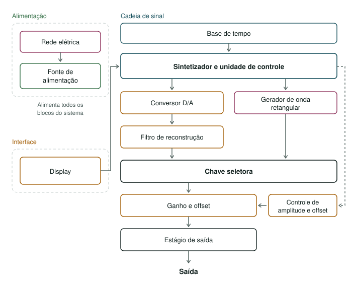

# Etapa 1

**(MÍNIMO DE 600 E MÁXIMO DE 1000 PALAVRAS no total do arquivo md.)**

A Etapa 1 compreende o planejamento e a definição da arquitetura do gerador de funções microcontrolado. Nesta fase, será elaborado o diagrama de blocos do sistema, escolhido o microcontrolador e definidos os componentes da interface, como display e botões. Também serão determinadas a topologia do circuito analógico e as características ajustáveis do equipamento, incluindo formas de onda, amplitude, frequência, duty cycle e offset.

## Desenvolvimento

### DAC x DDS

O primeiro estudo comparou um sintetizador digital direto (DDS) com a síntese pelo microcontrolador e saída por DAC. O DDS oferece boa resolução e troca rápida de frequência com menor carga de processamento [1], mas concentra a geração em um componente pronto. Com o DAC, o firmware produz e transfere as amostras, exigindo maior cuidado com temporização e filtragem, porém dando à equipe controle sobre a formação das ondas. Após consulta aos professores, escolheu-se essa solução pelo caráter mais autoral e didático.

### DAC interno x DAC externo

Um DAC interno reduziria componentes e conexões, mas sua resolução, velocidade e saída dependeriam do microcontrolador. O DAC externo exige uma interface adicional, porém pode ser escolhido, testado e substituído separadamente. Essa flexibilidade e a separação entre processamento digital e condicionamento analógico motivaram a escolha do conversor externo.

### Escolha do DAC: AD5689 x DAC0808

O AD5689, já disponível para a equipe, foi uma das opções consideradas. Ele possui dois canais, 16 bits, saída em tensão e comunicação SPI [2], favorecendo a precisão. Entretanto, sua atualização serial e seu tempo de acomodação limitariam a frequência de uma senoide representada por pelo menos 50 pontos.

O DAC0808 foi escolhido por priorizar velocidade: possui 8 bits, entrada paralela, saída em corrente e tempo típico de acomodação de 150 ns [3]. Uma senoide de 100 kHz com 50 pontos exige 5 MS/s, meta teoricamente compatível com o componente e que ainda será validada no sistema completo. Como limitações, ele ocupa oito GPIOs, oferece 256 níveis e requer conversão corrente-tensão.

### Definição dos parâmetros ajustáveis

Foram definidos como parâmetros preliminares: ondas senoidal, triangular, quadrada e dente de serra; frequência de 1 Hz a 100 kHz; amplitude máxima de 10 Vpp; offset de -5 V a +5 V; e impedância de saída de 50 Ω. Os limites de amplitude e offset, inclusive suas combinações, ainda serão validados. O equipamento será alimentado pela rede elétrica, com isolamento, retificação, filtragem e regulação para os circuitos digitais e analógicos.

### Escolha do microcontrolador

A escolha considerou a geração contínua para o DAC0808, temporização, DMA, GPIOs e interface touchscreen. Na condição mais exigente, 100 kHz com 50 pontos requer 5 MS/s, ou uma atualização a cada 200 ns. Por isso, a transferência não deve depender de uma interrupção da CPU para cada amostra.

| Microcontrolador | Recursos relevantes | Avaliação |
| --- | --- | --- |
| MSP430FR5994 | 16 MHz, DMA e plataforma conhecida [4] | Apenas 3,2 ciclos de clock por amostra a 5 MS/s; pouca margem para geração e interface |
| RP2040 | Dois Cortex-M0+ a 133 MHz, DMA e oito máquinas PIO [5] | Muito competente para controlar o DAC; interface gráfica exigiria mais recursos externos |
| ESP32-S3 | Dois núcleos a 240 MHz, GDMA e interface LCD paralela [6] | Forte para geração e interface; Wi-Fi e Bluetooth não são necessários atualmente |
| STM32G474 | Cortex-M4 a 170 MHz, FPU, DSP, DMA e timer de alta resolução [7] | Atende à geração e é a melhor alternativa para simplificar o projeto |
| **STM32H743ZI** | **Cortex-M7 a 480 MHz, DMA, ampla memória, LTDC e DMA2D [8]** | **Escolhido pela maior margem para geração, interface e futuras funções** |

O STM32G474 provavelmente atenderia ao requisito básico, assim como o RP2040 é uma opção forte para a geração pura por seu PIO. A escolha do STM32H743ZI não indica incapacidade dessas alternativas: sua vantagem é a margem para manter simultaneamente o fluxo de amostras, a interface gráfica, o ajuste de parâmetros e futuras funcionalidades.

A implementação prevista parte de um temporizador acionando transferências das amostras por DMA para o GPIO ligado ao DAC0808. Os oito bits deverão, preferencialmente, ocupar uma única porta GPIO. Ainda será necessário verificar a rota entre temporizador, controlador DMA, barramento e porta escolhida, definir os pinos e validar experimentalmente os 5 MS/s. O fluxo pretendido é: **tabela de amostras → DMA → GPIO → DAC0808 → condicionamento analógico → saída**.

## Testes

Descrição dos testes/validações realizadas. Use fotos, diagramas, tabelas, etc.

## Referências (links/datasheets/livros)

- [1] [Analog Devices — All About Direct Digital Synthesis](https://www.analog.com/en/resources/analog-dialogue/articles/all-about-direct-digital-synthesis.html)
- [2] [Analog Devices — Datasheet do AD5689/AD5687](https://www.analog.com/media/en/technical-documentation/data-sheets/AD5689_5687.pdf)
- [3] [Texas Instruments — Datasheet do DAC0808](https://www.ti.com/lit/ds/symlink/dac0808.pdf)
- [4] [Texas Instruments — Datasheet do MSP430FR5994](https://www.ti.com/lit/ds/symlink/msp430fr5994.pdf)
- [5] [Raspberry Pi — Datasheet do RP2040](https://datasheets.raspberrypi.com/rp2040/rp2040-datasheet.pdf)
- [6] [Espressif Systems — Datasheet do ESP32-S3](https://www.espressif.com/sites/default/files/documentation/esp32-s3_datasheet_en.pdf)
- [7] [STMicroelectronics — Datasheet do STM32G474](https://www.st.com/resource/en/datasheet/stm32g474ce.pdf)
- [8] [STMicroelectronics — Datasheet do STM32H743ZI](https://www.st.com/resource/en/datasheet/stm32h743zi.pdf)

