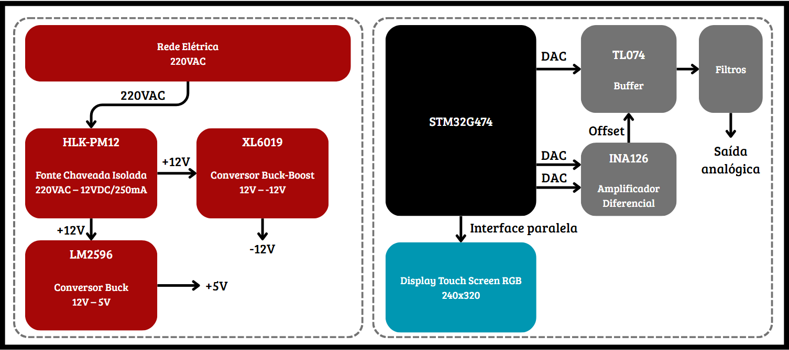

# Etapa 01

## Estrutura do Circuito
Para gerar as formas de onda, será utilizado um DAC interno de um MCU, portanto, não haverá uma topologia analógica para gerar os sinais. Desse modo, os blocos analógicos se resumem ao estágio de amplificação, offset e filtragem. Na imagem a seguir é possível visualizar o Diagrama de Blocos do circuito.

  

**Descrição:**
*   **STM32G474:** Microcontrolador responsável por gerar os pontos da onda e o sinal de offset via DAC, gerenciar o DMA e controlar a interface.
*   **Display:** TFT touchscreen de 2,4", 320 × 240 pixels e controlador ILI9341. O LCD utilizará barramento paralelo de 8 bits por GPIO, enquanto o touch resistivo de quatro fios será lido pelos ADCs do microcontrolador.
*   **Amplificador Diferencial:** Recebe os sinais de dois DACs para gerar a tensão de offset.
*   **Buffer:** Amplifica a tensão e aplica o offset.
*   **Filtros:** Suavizam a variação discreta gerada pelo DAC.
*   **HLK-PM12:** Fonte chaveada isolada da Hi-Link para saída de +12V/250mA a partir da rede elétrica.
*   **XL6019:** Conversor DC-DC Buck-Boost que gera -12V a partir dos +12V, utilizado na alimentação assimétrica dos AmpOps.
*   **LM2596:** Gera os +5V de alimentação do MCU e do display.

## 2. Escolha dos Componentes da Interface

Foi escolhido um módulo TFT touchscreen de 2,4", com resolução de 320 × 240 pixels, controlador ILI9341 e painel resistivo de quatro fios. O mesmo módulo já foi utilizado no projeto [Osciloscópio Portátil](https://github.com/fab-rodrigs/portable-oscilloscope-pi3), o que fornece uma referência prática de funcionamento e de integração com a biblioteca gráfica LVGL. A tela permitirá selecionar a forma de onda e ajustar frequência, amplitude e offset.

Apesar de o ILI9341 aceitar diferentes interfaces, o módulo de referência será utilizado em modo paralelo de 8 bits. A comunicação do LCD empregará as linhas de dados D0–D7 e os sinais de controle CS, RS/DC, WR, RD e RST. O touchscreen não utiliza SPI: suas quatro linhas serão alternadas entre GPIO e entradas ADC para medir as coordenadas do toque. Essa interface ocupa vários pinos do STM32G474 e, por isso, seu mapeamento deverá ser considerado junto aos DACs, OPAMPs e demais periféricos. O driver usado no projeto de referência poderá orientar o desenvolvimento, mas precisará ser adaptado do FRDM-K64F para o STM32G474.

## 3. Requisitos e Seleção do Microcontrolador (MCU)

### 3.1. Requisitos Técnicos
*   Mínimo de 3 canais de DAC internos.
*   Pelo menos um dos DACs com settling time menor do que 5us (para obter pelo menos 10 pontos por período em 20kHz).
*   Controlador DMA para atualização contínua do DAC (mínimo de 200 kSPS).
*   Interface paralela de 8 bits para o LCD.
*   ADC para o touchscreen resistivo.
*   Suporte a modos de baixo consumo de energia.
*   Disponibilidade em placas de desenvolvimento.

### 3.2. Análise Comparativa

| Critério | ATmega | dsPIC33CK | MSP430FR2355 | ESP32-S3 | RP2350 | **STM32G474** |
|:--|:-:|:-:|:-:|:-:|:-:|:-:|
| **C1** — DAC | Não `0` | Sim `3` | Sim `4` | Não `0` | Não `0` | Sim **`7`** |
| **C2** — Settling time | Não | Sim | Sim | Não | Não | Sim **`3 µs`** |
| **C3** — DMA | Não | Sim | Não | Sim | Sim | Sim |
| **C4** — LCD paralelo 8 bits | Não | Sim | Sim | Sim | Sim | Sim |
| **C5** — ADC | Parcial | Sim | Sim | Parcial | Sim | Sim |
| **C6** — Baixo consumo | Sim | Sim | Sim | Sim | Sim | Sim |
| **C7** — Kit de Desenvolvimento | Sim | Não | Sim | Sim | Sim | Sim |
| **Aprovações** | `2/7` | **`6/7`** | `6/7` | `5/7` | `5/7` | **`7/7`** |

### 3.3. Conclusão da Seleção
O **STM32G474** foi selecionado por atender todos os requisitos apresentados.
