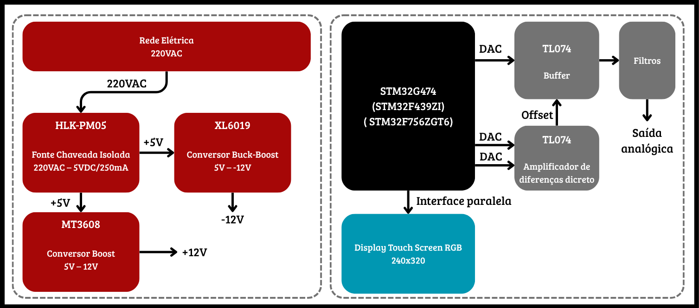
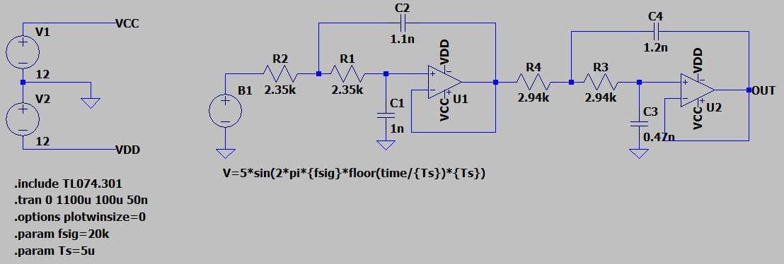
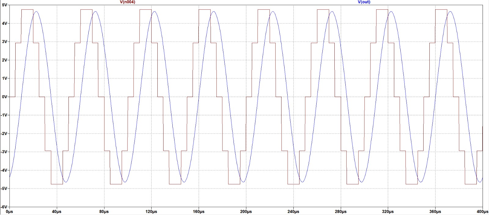
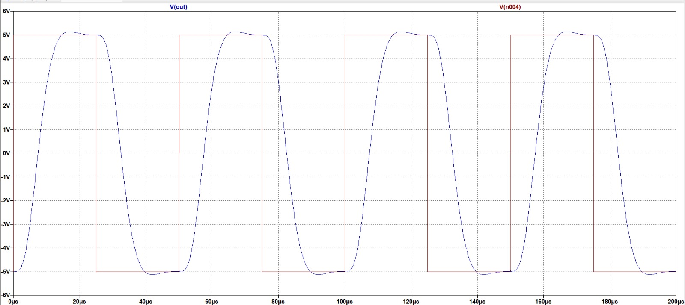
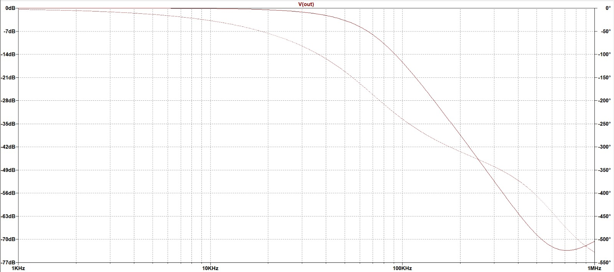

# Hardware

Este documento detalha o desenvolvimento, as simulações e os testes práticos do estágio analógico e da interface física do gerador de funções correspondentes à Etapa 2. O foco desta fase foi a reestruturação da fonte de alimentação, o dimensionamento do filtro de reconstrução e a montagem do circuito em bancada.

## 1. Atualização da Arquitetura e Alimentação

O diagrama de blocos do sistema foi reformulado devido à disponibilidade de uma fonte de 5 V com maior capacidade de corrente. A topologia original, que utilizava uma fonte HLK-PM12 acompanhada dos conversores LM2596 e XL6019, foi substituída. A nova arquitetura utiliza o módulo **HLK-PM05** como fonte primária, associado a um conversor **boost MT3608**, e mantém o módulo **buck-boost XL6019** para gerar as tensões simétricas.

Além disso, para viabilizar financeiramente o projeto, o amplificador diferencial integrado INA126 foi descartado devido ao seu alto custo. Em seu lugar, optou-se pela construção de um amplificador com componentes discretos. O arranjo atualizado do sistema pode ser visualizado na imagem abaixo.

  

<em>Diagrama de blocos atualizado da Etapa 2.</em>

## 2. Condicionamento de Sinal: Filtro Bessel e Amplificador Discreto

Para reduzir a distorção temporal das formas de onda, o filtro simples inicial foi substituído por um **filtro passa-baixa de Bessel em topologia Sallen-Key**. Essa aproximação apresenta fase aproximadamente linear, atraso de grupo mais constante na faixa de passagem e pouco overshoot [1][2][3].

A topologia analógica, incluindo o filtro Bessel e o novo amplificador diferencial discreto, foi projetada e avaliada em software. O esquemático testado virtualmente é apresentado na figura a seguir.

  

<em>Esquemático do circuito analógico simulado.</em>

### 2.1. Resultados da Simulação

Os testes em ambiente de simulação apresentaram resultados teóricos razoáveis e alinhados com o equacionamento matemático:

*   **Senoide Discretizada:** A imagem a seguir ilustra o comportamento do filtro ao receber a entrada de uma senoide discretizada em amplitude (simulando os "degraus" característicos da saída de um DAC), evidenciando a capacidade de suavização do circuito.

  

<em>Resposta simulada para uma senoide discretizada.</em>

*   **Onda Quadrada:** A resposta transitória teórica do filtro para uma entrada em onda quadrada é demonstrada na imagem abaixo.

  

<em>Resposta transitória simulada para uma onda quadrada.</em>

*   **Resposta em Frequência:** O diagrama de Bode contendo a atenuação e o comportamento linear de fase esperado é apresentado na figura seguinte.

  

<em>Resposta em frequência simulada do filtro.</em>

## 3. Testes de Bancada e Ajustes de Projeto

O circuito validado na simulação foi prototipado fisicamente. Durante os testes físicos, o desempenho do filtro divergiu das simulações. Constatou-se que a topologia não funcionou de maneira estável para sinais com grandes variações abruptas. Diante deste resultado prático, definiu-se uma nova diretriz arquitetural: **a geração da onda quadrada será realizada separadamente**, contornando a malha do filtro de reconstrução, que ficará restrito à suavização das demais formas de onda.

## 4. Interface Gráfica

Como parte do desenvolvimento da interface de usuário, módulos TFT foram testados em um protótipo isolado antes da integração com o microcontrolador principal do projeto. O controlador RM68090 foi escolhido devido ao seu bom suporte e documentação. Um protótipo navegável foi criado para testar ergonomia, leitura de toque e dimensionamento de telas para parâmetros como amplitude, frequência, offset e duty cycle.

Para informações aprofundadas sobre o processo de calibração e construção visual, acesse a documentação do display. Os códigos-fonte utilizados no protótipo e nos testes do display estão disponíveis no diretório dedicado de software:
- [Testes e seleção do display](./display.md)
- [Códigos-fonte da interface (Pasta Software)](../software/)

## Referências (links/datasheets/livros)

1. SEDRA, Adel S.; SMITH, Kenneth C. *Microeletrônica*. 7. ed. São Paulo: Pearson Education do Brasil, 2017.
2. [Analog Devices — fundamentos de DDS e filtros de reconstrução](https://www.analog.com/media/en/training-seminars/design-handbooks/Technical-Tutorial-DDS/Section4.pdf)
3. [Electronics Tutorials — Sallen-Key Filter](https://www.electronics-tutorials.ws/filter/sallen-key-filter.html)
